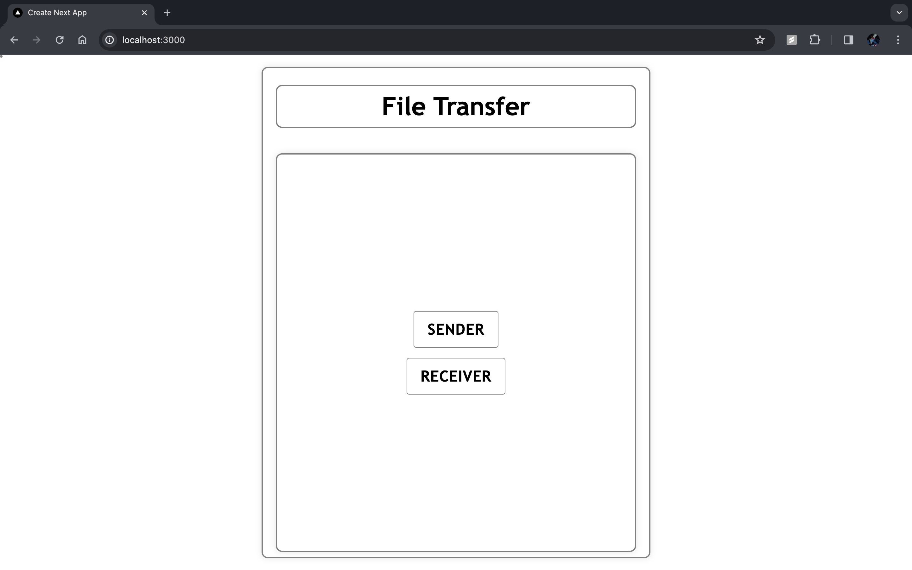
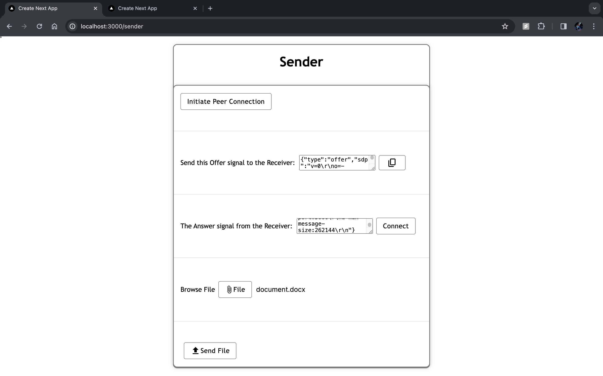
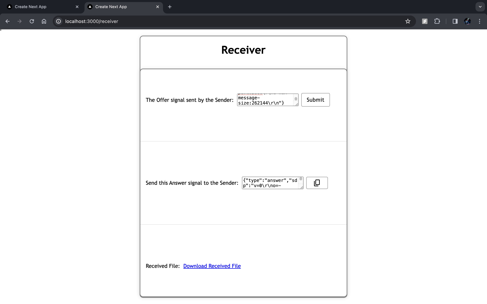

# File-Transfer

File-Transfer is a serverless, peer-to-peer file transfer system developed using cutting-edge technologies. It allows users to transfer large files between cross-browser environments quickly and securely. In a recent test, it successfully transferred a 1 GB file in just 80 seconds.

## Technologies Used

- **Front End**: Developed using Next.js for a robust and efficient front-end experience.
- **Scalability**: TypeScript was employed to ensure code scalability and maintainability.
- **User Interface**: Material UI was chosen for its intuitive and visually appealing user interface design.

## Features

- **Fast Transfer**: Transfers large files quickly between different browser environments.
- **Secure Connections**: Utilizes WebRTC and the simple-peer library to establish secure, peer-to-peer connections.
- **User-Friendly**: Offers an intuitive user interface designed with Material UI for ease of use.

## Getting Started

1. Clone the repository: `git clone https://github.com/Praneeth003/file-transfer.git`
2. Install dependencies: `npm install`
3. Start the development server: `npm run dev`

## Screenshots

## Contributing

I welcome contributions from the community to enhance File-Transfer. If you have any ideas, bug fixes, or feature requests, please submit a pull request or open an issue on GitHub.
